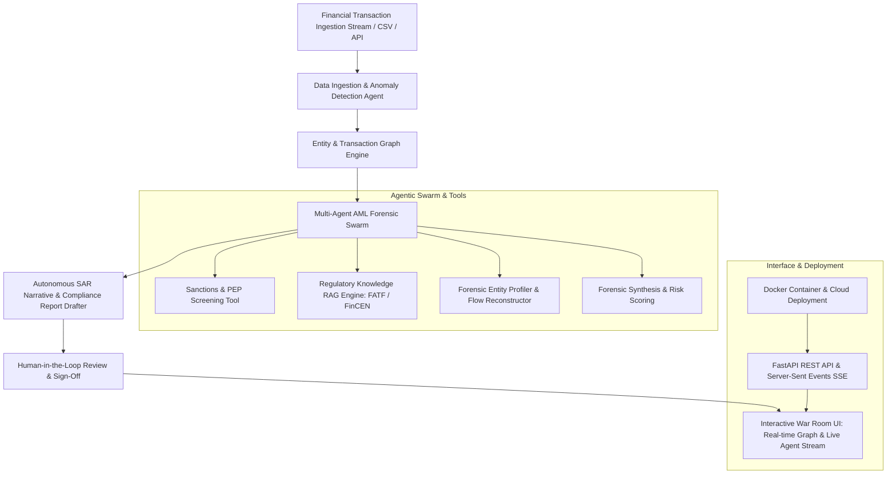

# 🛡️ FinAudit AI — Autonomous AML & Forensic Financial Intelligence Swarm

[](https://www.python.org/)
[](LICENSE)
[](Dockerfile)
[](https://fastapi.tiangolo.com)
[]()

**FinAudit AI** is an enterprise-grade Autonomous Multi-Agent AI system designed for Anti-Money Laundering (AML) compliance, forensic financial network analysis, sanctions screening, and automated **FinCEN Form 111 Suspicious Activity Report (SAR)** narrative drafting.

---

## 🏛️ System Architecture



---

## 🚀 Key Features

- 🧠 **Autonomous Multi-Agent Swarm**:
  - **Triage & Anomaly Detector**: Analyzes transaction streams for structuring/smurfing ($10k CTR avoidance), rapid pass-through velocity, high-risk jurisdiction corridors, circular round-trip wash routing, and trade-based money laundering (TBML).
  - **ReAct Forensic Investigator Agent**: Formulates laundering hypotheses, executes tool invocations, and builds chronological forensic trails.
  - **Autonomous SAR Drafter Agent**: Synthesizes cross-source evidence into official FinCEN Form 111-compliant Suspicious Activity Reports.
- 🔍 **Specialized Investigative Tools**:
  - **Sanctions & PEP Screener**: Screens entities against simulated OFAC SDN, UN Consolidated, EU Sanctions, and Politically Exposed Persons (PEP) registries with fuzzy name matching and alias resolution.
  - **Regulatory RAG Knowledge Base**: Retrieves statutory authorities, FATF 40 Recommendations (Rec. 10, 16, 20), and FinCEN Bank Secrecy Act guidelines (31 U.S.C. § 5324).
  - **Forensic Flow Reconstructor**: Builds counterparty profiles, calculates net inflows/outflows, and traces transit account layering.
- 🕸️ **Interactive Network Graph Visualizer**:
  - NetworkX-powered graph engine rendered via Vis.js with color-coded risk tiers, directional animated transaction flow, and hub centrality analysis.
- ⚡ **Real-Time Agent Thought Streaming**:
  - Server-Sent Events (SSE) pipeline streaming agent reasoning traces, tool executions, and confidence metrics directly to the war room UI.
- 📑 **Human-in-the-Loop Compliance Sign-Off**:
  - Interactive SAR preview with official legal sections and 1-click compliance officer electronic sign-off and JSON dossier export.
- 🔌 **Flexible Multi-Provider LLM Integration**:
  - Native support for **Google Gemini**, **OpenAI**, **Groq**, or the built-in **Deterministic Autonomous Reasoning Engine** (runs 100% offline without API keys).

---

## 📂 Project Structure

```
FinAudit-AI/
├── backend/
│   ├── agents/
│   │   ├── __init__.py
│   │   ├── investigator_agent.py    # ReAct autonomous investigator agent
│   │   ├── llm_client.py            # Multi-provider LLM interface (Gemini/OpenAI/Groq/Offline)
│   │   ├── orchestrator.py          # Multi-agent coordinator & SSE streamer
│   │   └── sar_drafter_agent.py     # FinCEN Form 111 SAR report generator
│   ├── engine/
│   │   ├── __init__.py
│   │   ├── anomaly_detector.py      # Statistical & heuristic financial crime detector
│   │   └── graph_engine.py          # NetworkX transaction graph constructor
│   ├── models/
│   │   ├── __init__.py
│   │   └── transaction.py           # Pydantic schemas (Transactions, SARs, Graph, Alerts)
│   ├── scenarios/
│   │   ├── __init__.py
│   │   └── scenario_loader.py       # Curated real-world financial crime datasets
│   ├── tools/
│   │   ├── __init__.py
│   │   ├── forensics_tools.py       # Entity profiler & chronological timeline builder
│   │   ├── regulatory_rag.py        # FATF / FinCEN legal knowledge base & search
│   │   └── sanctions_checker.py     # OFAC SDN / UN / PEP watchlist screening tool
│   └── main.py                      # FastAPI REST API server & static file host
├── static/
│   ├── index.html                   # Cyber-finance war room dashboard UI
│   ├── script.js                    # Vis.js graph, SSE streaming & modal interaction
│   └── style.css                    # Glassmorphism dark theme UI styling
├── tests/
│   ├── __init__.py
│   └── test_finaudit.py             # Complete unit and integration test suite
├── Dockerfile                       # Multi-stage production container
├── docker-compose.yml               # Container deployment orchestrator
├── run.py                           # Convenient application runner
├── requirements.txt                 # Project dependencies
└── README.md                        # Documentation
```

---

## 🎯 Curated Financial Crime Scenarios Included

1. **Smurfing & Structuring Network**: Coordinated individual smurfs deposit sub-$10,000 cash bundles in rapid succession, funneled into an offshore shell account in the Cayman Islands.
2. **Sanctions Evasion & Front Shell**: OFAC-sanctioned energy entity moves $350k+ via Cypriot maritime logistics front to bypass correspondent banking sanctions filters.
3. **Trade-Based Money Laundering (TBML)**: High-value phantom advisory and software invoices executed in a circular wash cycle ($A \to B \to C \to A$) between Panama, Switzerland, and the US.
4. **Crypto Mixer & Fiat Off-Ramp**: High-velocity peer-to-peer cryptocurrency mixing platform disperses proceeds to accounts that immediately execute commercial real estate escrow.

---

## 🛠️ Quick Start

### 1. Local Setup

```bash
# Clone repository
git clone https://github.com/aditya001824/AI-Phishing-Detector.git
cd AI-Phishing-Detector

# Create and activate virtual environment
python -m venv venv
# On Windows:
venv\Scripts\activate
# On Linux/macOS:
source venv/bin/activate

# Install dependencies
pip install -r requirements.txt
```

### 2. Configure (Optional)

Copy `.env.example` to `.env` if you want to supply custom LLM keys (optional):

```bash
cp .env.example .env
# Set GEMINI_API_KEY=... or OPENAI_API_KEY=...
```

### 3. Launch Application

```bash
python run.py
# Or with uvicorn directly:
uvicorn backend.main:app --host 0.0.0.0 --port 8000 --reload
```

Open your browser at:
- **War Room Dashboard**: `http://localhost:8000`
- **Interactive OpenAPI Docs**: `http://localhost:8000/docs`

---

## 🐳 Run with Docker

```bash
# Using docker-compose
docker-compose up --build

# Or standard Docker
docker build -t finaudit-ai .
docker run -p 8000:8000 finaudit-ai
```

---

## 🧪 Running Automated Tests

```bash
pytest tests/test_finaudit.py -v
```

All 10 test suites verify anomaly detection, graph traversal, sanctions fuzzy matching, regulatory RAG retrieval, multi-agent orchestration, and API endpoints.

---

## 📄 License

MIT License. Designed for enterprise AML compliance teams, forensic accountants, and financial crime investigators.